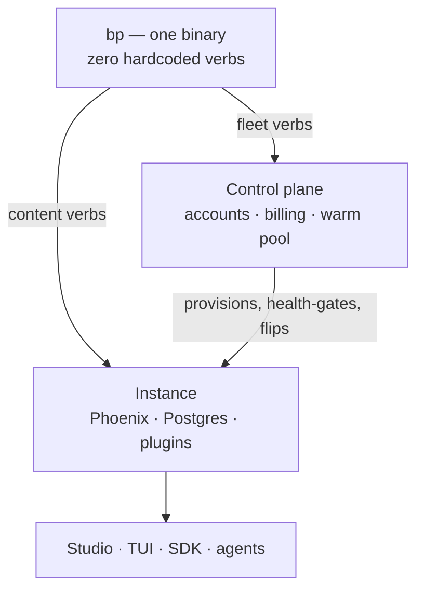

<!-- doc-tier: human | canonical-for: project-overview | budget: 1750tok -->
# Barkpark

[](https://barkpark.cloud/new?template=blog-starter)

**[Live Studio →](https://api.barkpark.cloud/studio)** · **[Install](#install--connect)** · **[Deploy](#be-your-own-cloud)** · **[Barkpark Cloud](https://barkpark.cloud)** · **[Docs](docs/INDEX.md)**

**A lightweight operating system for everything you and your AI make.** One content model —
tasks, papers, sheets, media, anything you can schema — with an AI agent driving the API while
you edit the same documents live in Studio or a terminal.

**Barkpark is yours** — open source you run anywhere: a laptop, a VPS, a box at home. You own
your content, schema, server and source code; you should never have to rely on us. Or use
**[Barkpark Cloud](https://barkpark.cloud)** — the official home: one login across your whole
fleet, and a way to cheer the work on. [The full stance →](docs/PHILOSOPHY.md)

**2.81M lines · 9,366 files · 16,900+ tests · 561 routes · 11 plugins · four runtimes.**

## What it replaces

| What Barkpark does | What you'd otherwise buy |
|---|---|
| Content model, API, editing Studio | Sanity · Contentful · Strapi |
| Rich documents (Papers) | Notion · Google Docs |
| Spreadsheets, 142 real formulas | Airtable · Google Sheets |
| Media library, renditions, signed URLs | Cloudinary · Bynder |
| Search with click-learning | Algolia · Typesense |
| Task board and work queues | Linear · Jira |
| Site hosting, builds, previews | Vercel · Netlify |
| Server provisioning and lifecycle | Render · Fly.io · Heroku |
| SSO — SAML, OIDC, SCIM, passkeys | Auth0 · WorkOS · Okta |
| Book metadata (ONIX 3.0) | Firebrand · Bokbasen |
| Agents on the work ledger | *no standard product* |

Every row has a better-funded competitor; for any single row, buy theirs. What has no
equivalent is the **combination** — and it isn't a bundle. One content model, one permission
model and one deploy path sit under every row, so a document, a sheet cell, an asset, a task
and a book record are the same object with the same access rules.

## Install & connect

Two commands on macOS / Linux (the live [Studio](https://api.barkpark.cloud/studio) needs none):

```bash
curl -fsSL https://raw.githubusercontent.com/FRIKKern/barkpark/main/scripts/install-cli.sh | sh
bp setup          # local · deploy · connect — pick one, it does the rest
```

Own a server? `bp setup --target deploy` installs over SSH.

Windows: `irm https://raw.githubusercontent.com/FRIKKern/barkpark/main/scripts/install-cli.ps1 | iex`, then `.\scripts\setup-windows.ps1`.

[Quickstart](docs/setup/QUICKSTART.md) · [Cursor](docs/setup/CURSOR.md) · [Learn & own](docs/learn/README.md) · [From source](docs/setup/SETUP.md)

## Create fast

Define a shape, get every surface — Studio pane, TUI desk, REST routes, CLI verbs — no client code:

```bash
bp make schema recipe --out recipe.json   # skeleton — fill the blanks
bp schema apply --file recipe.json        # the type now exists everywhere
bp seed recipe --count 5 --publish        # schema-valid sample data, live
bp tinker                                 # REPL: query it, poke it
```

## Your AI agent, unreasonably powerful

Point any agent at a Barkpark and it gains structured memory with hands:

- **The whole API in one call** — `bp capabilities -o json` teaches an agent every noun, verb
  and route. No docs pasted into context.
- **A real task board** — dependencies, priorities, and an atomic claim/close contract built
  for concurrent workers:
  ```bash
  bp task next agent-1                      # atomically claim the next ready task
  bp task claim t1 a1 --resources lib/x.ex  # fence files against parallel workers
  bp task close t1 agent-1 1                # CAS on the claim epoch
  ```
  Because the board lives in Barkpark, not the session, **an agent can crash and still be on
  track** — it reclaims its work, context intact.
- **Papers** — agents write long-form docs over a token-gated ingest API; read at
  `/papers/:slug`, edit live.
- **No black boxes** — you watch every change land live in Studio. JSON when piped, atomic
  batch writes via `-f`, stable exit codes.

This repo runs on it: agents claim work from `bp task ready`, publish design papers, and score
the codebase into a browsable graph ([Cody](tooling/README.md) — one paper per source file).

## Four ways in

| Surface | What it is |
|---|---|
| **`bp` CLI** | One static binary speaking the whole API, assembled live from `GET /v1/capabilities`. |
| **Web Studio** | Multi-pane LiveView desk at `/studio` — drill, filter, autosave, publish, real-time. |
| **Terminal TUI** | The same desk, keyboard-driven (`bp` with no args). |
| **REST API** | Public reads, token-authed writes, Sanity-compatible mutations, SSE stream. |

## How it works



- **One schema, many surfaces.** A single SchemaDefinition drives Studio, TUI, REST, and CLI.
- **Manifest-driven contract.** The server projects nouns, verbs, and routes into
  `GET /v1/capabilities`; every client reads the same projection — default-deny,
  existence-hiding, keyed on auth tier.
- **Proven parity, not promised.** One document renders in Elixir, TypeScript and Go; 62 frozen
  fixtures fail the build if they disagree.
- **The plugin highway.** Plugins ride the `Barkpark.Plugin` behaviour — schemas, routes,
  workers, cron, CLI verbs travel module → manifest → `bp` shell.
  **With all plugins off, Barkpark still works** — an AST gate proves it.

Stack: Elixir / Phoenix LiveView · PostgreSQL · Oban · Go (CLI + TUI, one binary) · Caddy.
Plugins: **Tasks · Bulldocs · Media · OnixEdit · Sheets · Frt · GitHub · Pulse · Quiz · Scaffy ·
Tickets**. It grades itself — [`tooling/`](tooling/README.md) recomputes 14 critics live.

## Be your own cloud

Any Ubuntu 22.04+ box → HTTPS + CLI login. Point a DNS A record at the box, run `deploy.sh`
(installs Barkpark + Caddy/TLS, prints your admin token):

```bash
scp deploy.sh root@SERVER_IP:/root/
ssh root@SERVER_IP "DOMAIN=app.example.com BARKPARK_SEED_PROFILE=clean bash /root/deploy.sh"
```

`DOMAIN` = public hostname, never an IP. Walkthrough: [`GO-LIVE.md`](docs/setup/GO-LIVE.md).
Prefer it handled? **[Barkpark Cloud](https://barkpark.cloud)** provisions on two clouds, deploys
blue/green, and can archive an instance and resurrect it on the *other* cloud. Or run the
control plane ([`cloud/`](cloud/README.md)) yourself.

## Documentation

| Doc | What |
|---|---|
| [`GO-LIVE.md`](docs/setup/GO-LIVE.md) · [`TASK-SYSTEM.md`](docs/setup/TASK-SYSTEM.md) | Deploy a public instance · the task system |
| [`HANDBOOK.md`](docs/cli/HANDBOOK.md) · [`cheatsheets/`](docs/cheatsheets/) | Full `bp` manual · one-pagers |
| [`api-v1.md`](docs/api-v1.md) · [`auth.md`](docs/auth.md) | HTTP contract · tokens and tiers |
| [`plugins.md`](docs/cards/plugins.md) | Build a plugin |

## License

MIT
