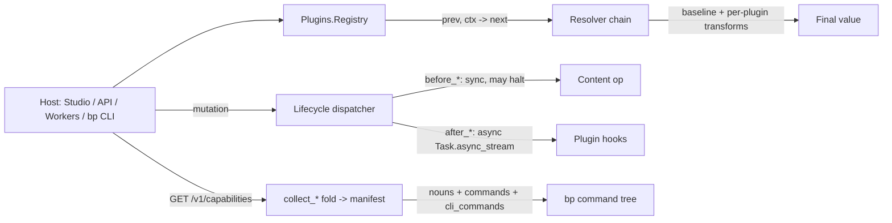
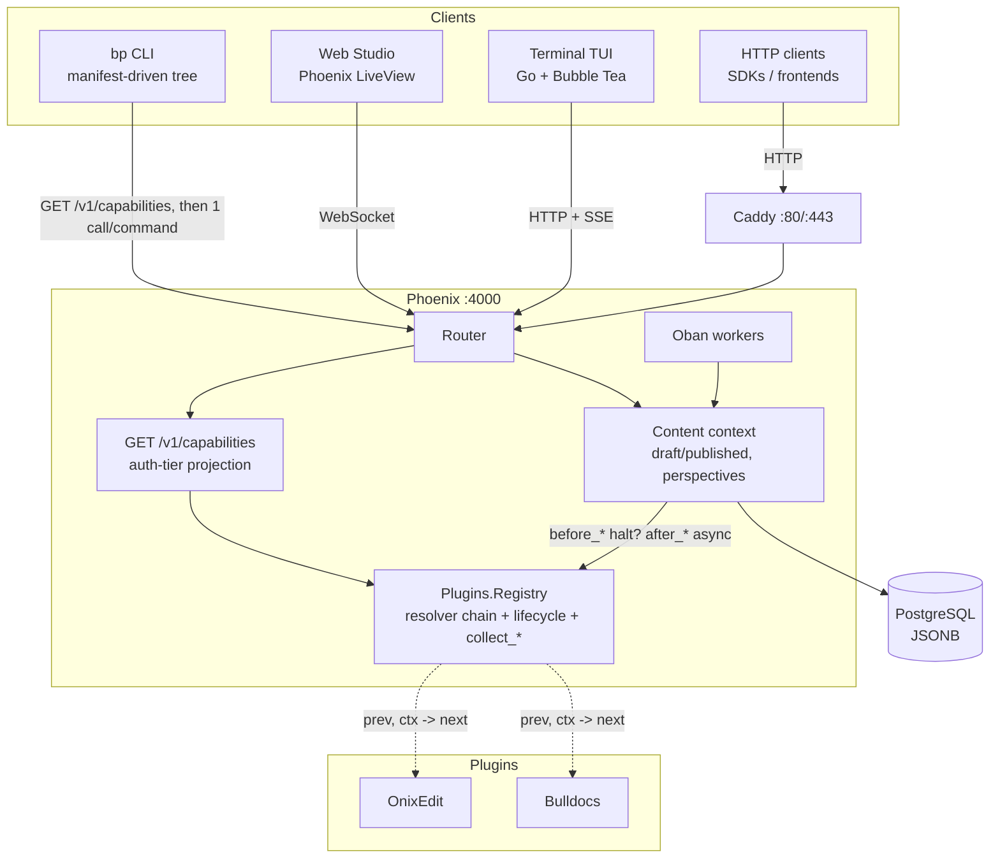

# Barkpark

**A headless CMS where the command line is a first-class client.** One Sanity-style content model, four ways in: a Phoenix LiveView **Web Studio**, a Go Bubble Tea **Terminal TUI**, a **REST API**, and a single-binary **`bp` CLI** whose entire command tree is assembled live from the server's capabilities.

**Live demo:** http://89.167.28.206/studio

| Surface | What it is |
|---|---|
| **`bp` CLI** ⟵ *new* | One static binary that **is** your whole API. `bp <noun> <verb>` — built live from `GET /v1/capabilities`. Same binary as the TUI. |
| **Web Studio** | Multi-pane LiveView desk at `/studio` — drill, filter, edit-with-autosave, publish. Real-time across tabs. |
| **Terminal TUI** | The same desk in your terminal, keyboard-driven, over HTTP + SSE. (`barkpark` with no args.) |
| **REST API** | Public reads, token-authed writes, Sanity-compatible mutation envelope, SSE change stream. |

## At a glance

| | |
|---|---|
| Clients | **`bp` CLI** · Web Studio (LiveView) · Terminal TUI (Go) · REST API |
| Core model | Sanity-style draft/published, perspectives (`published` / `drafts` / `raw`) |
| The CLI idea | **One binary = your whole API.** The `<noun> <verb>` tree is a pure function of the server's `GET /v1/capabilities` — install a plugin, its verbs appear; disable it, they vanish. One command = one API call. |
| Plugin system | `Barkpark.Plugin` behaviour — 14 callbacks, resolver chain, lifecycle hooks. Plugins ship data + behaviour, never UI. |
| Reference plugins | **OnixEdit** (ONIX 3.0 book metadata + Bokbasen) · **Bulldocs** (portable-doc papers at `/papers/:slug`) |
| Stack | Elixir 1.15+ (tested 1.19) / Phoenix LiveView 1.1 / PostgreSQL / Oban / Go 1.24+ |
| Tests | 1324 mix tests, 47 HTTP integration tests, full ONIX export round-trip |

---

## The `bp` CLI

`bp` is a single static Go binary that is, in effect, **your whole Barkpark API on the command line**. There is no hardcoded command list. When `bp` starts it asks the server `GET /v1/capabilities`, gets back an auth-tier-projected manifest of nouns and verbs, and assembles its command tree from that. **Install a plugin on the server and its verbs appear in `bp` with zero client changes; disable it and they vanish.** Every `bp <noun> <verb>` maps to exactly one HTTP call.

It is the *same binary* as the Terminal TUI: run `barkpark` (alias `bp`) with **no arguments** and you get the interactive TUI; run it with a command and you get the CLI.

### Install

```bash
curl -fsSL https://raw.githubusercontent.com/FRIKKern/barkpark/main/scripts/install-cli.sh | sh
```

The installer detects your OS (`darwin`/`linux`) and arch (`arm64`/`amd64`), downloads the matching `bp-<os>-<arch>` release asset, installs it to `/usr/local/bin` (falling back to `~/.local/bin` when that's not writable), and prints a PATH hint if needed. Two env knobs:

| Env | Effect |
|---|---|
| `BARKPARK_BIN_DIR` | Override the install directory |
| `BARKPARK_CLI_RELEASE_BASE` | Override the release download base URL |

Verify, then build from source if you prefer (Go ≥ 1.24):

```bash
bp version          # -> barkpark 1.0.0
bp version -o json  # -> {"cli_version":"1.0.0"}

make cli-build      # native binary  -> dist/bp
make cli-release    # cross-compile  -> dist/bp-{darwin,linux}-{arm64,amd64}
```

### 60-second tour

Every command below is **verified working against production**. Reads are public or auth-by-tier; writes can be previewed with `--dry-run`.

```bash
# Point it anywhere (defaults to http://localhost:4000 with the dev token)
export BARKPARK_API_URL=http://89.167.28.206:4000

# --- Reads (public / auth-by-tier) ---
bp doc ls post                       # list 'post' documents (table on a TTY, JSON when piped)
bp doc get post p2                   # fetch one document by type + id
bp search query headless             # full-text search
bp workspace ls                      # workspaces your token reaches
bp task ls                           # paginated task list
bp plugin ls                         # installed plugins

# --- Discover & identity ---
bp capabilities -o json              # the resolved manifest: server, your tier, every command
bp whoami                            # active target + your resolved auth tier (⚠ PROD marker on prod-named targets)

# --- Plugin verbs (appear because the plugin is installed server-side) ---
bp bulldocs publish 2026-06-07-demo -f paper.json        # upsert a paper (ingest tier)
bp bulldocs patch  2026-06-07-demo -f ops.json --if-rev 1  # atomic block-ops, optimistic guard
```

### Built for agents

`bp` is designed to be driven by scripts and LLM agents as much as by humans. The differentiators are real, not aspirational:

- **Discover once, act forever.** `bp capabilities -o json` returns the entire callable surface — ids, auth tiers, HTTP method + path template — so an agent learns the API in one call and never guesses a route.
  ```bash
  bp capabilities -o json | jq '.commands[] | {id, auth_tier, path: .http.path_template}'
  ```
- **JSON in, JSON out.** `-o json` (or `--json`) everywhere; `-o yaml`; `-o minimal`. When stdout is a pipe the CLI **defaults to JSON**, so `bp doc ls post | jq` just works. The API wraps payloads in `{"result": …}`; `bp` unwraps it so you see the data, not the envelope.
- **Atomic batch writes.** A `batch` command takes a JSON array of operations and applies them in **one** request. The universal `-f` flag aliases `--file`; pass a path or `-` for stdin.
  ```bash
  bp doc mutate -f mutations.json            # {"mutations":[…]}  applied atomically
  bp bulldocs patch 2026-06-07-demo -f ops.json   # {"ops":[…]}    applied atomically
  cat ops.json | bp bulldocs patch 2026-06-07-demo -f -
  ```
- **Minimal receipts.** `-q` forces the token-efficient write receipt — `rev: …` plus any created `id:` — instead of a full document dump. Ideal for chained agent steps.
- **`--dry-run`.** Prints the *resolved* request (method, absolute URL, tier-appropriate headers with credentials redacted, body) and exits `0` **without sending**. Honest about its limits: v1 has no server validate-only, so it announces `dry-run: client-side preview only`.
- **Stable exit codes.** `bp` maps the API envelope's `error.code` string to a fixed process exit — it **never** re-derives the exit from the HTTP status. Branch on the number:

  | Exit | Meaning | Exit | Meaning |
  |---|---|---|---|
  | `0` | success | `4` | not-found |
  | `1` | generic / network / unknown | `5` | validation |
  | `2` | usage / unknown command | `6` | conflict (`rev_mismatch`, lifecycle `halted`) |
  | `3` | auth / forbidden | `7` | rate-limited |
  |   |   | `8` | server (5xx) |

### The command surface

The core (non-plugin) nouns and verbs, exactly as they appear in the capabilities manifest. Your live surface comes from *your* server — run `bp capabilities` to see what your token can reach. The manifest is **auth-tier projected**: an anonymous caller doesn't even learn the names of admin-only nouns (default-deny, existence-hiding).

| Command | HTTP | Tier | Notes |
|---|---|---|---|
| `bp doc get <type> <doc_id>` | GET | none | `--perspective published\|drafts\|raw` |
| `bp doc ls <type>` | GET | none | Paginated — `--limit` `--offset` `--all` |
| `bp doc query <type>` | GET | none | Paginated; `--query <expr>` filter |
| `bp doc mutate` | POST | write | **Batch** `{"mutations":[…]}` via `-f` |
| `bp schema get <name>` | GET | admin | Fetch one schema |
| `bp schema apply` | POST | admin | Register/update a schema; body via `-f` |
| `bp media ls` | GET | none | Paginated |
| `bp media upload <file>` | POST | write | Upload an asset |
| `bp search query <q>` | GET | none | `--engine postgres\|indx`, `--limit` |
| `bp workspace ls` | GET | read | Workspaces your token reaches |
| `bp workspace project-create <name>` | POST | scoped_admin | Project verbs fold under `workspace` |
| `bp task ls` / `task ready` | GET | read | Paginated; `--limit` |
| `bp task get <id>` | GET | read | One task |
| `bp task claim <id>` / `task close <id>` | POST | read | Claim / close a task |
| `bp webhook ls` | GET | admin | List subscriptions |
| `bp webhook create <url>` | POST | write | Create a subscription |
| `bp rail path <goal>` | GET | read | Goal-path lifecycle events |
| `bp plugin ls` | GET | admin | Installed plugins |
| `bp plugin settings <name>` | PUT | admin | `--set key=value` (repeatable) |

**Plugin verbs** fold into the *same* `commands[]` array via each plugin's `cli_commands/0` callback — no host edit, no client edit. They're tagged `source: plugin:<slug>`:

| Command | HTTP | Tier | Notes |
|---|---|---|---|
| `bp bulldocs publish <slug>` | POST | ingest | Upsert a paper from a portable-doc/HTML payload; body via `-f` |
| `bp bulldocs patch <slug>` | POST | ingest | **Batch** block ops `{"ops":[…]}` via `-f`; `--if-rev <n>` optimistic guard |
| `bp bulldocs intents` | GET | ingest | List pending actionable paper intents |
| `bp bulldocs intent-processed <id>` | POST | ingest | Mark an intent processed |
| `bp onixedit export <dataset> <id>` | GET | admin | Export a book document as ONIX 3.0 XML |

A few commands are **CLI-native built-ins** outside the manifest tree: `capabilities`, `whoami`, `version`, `login`, `completion`, `help`.

**Auth & context.** Each command declares one of six auth tiers — `none`, `read`, `write`, `admin`, `scoped_admin`, `ingest` — and `bp` attaches the right credential per tier (bearer token, or the separate ingest secret for `ingest`-tier verbs). The four context fields resolve **independently**, by this precedence:

```
flags  >  env (BARKPARK_*)  >  active context  >  defaults
```

| Field | Flag | Env | Default |
|---|---|---|---|
| server | `-s` | `BARKPARK_API_URL` / `BARKPARK_SERVER` | `http://localhost:4000` |
| workspace | `-w` | `BARKPARK_WORKSPACE` | `default` |
| project | `-p` | `BARKPARK_PROJECT` | `default` |
| dataset | `-d` | `BARKPARK_DATASET` | `production` |
| token | — | `BARKPARK_API_TOKEN` | `barkpark-dev-token` (dev) |
| ingest secret | — | `BARKPARK_INGEST_TOKEN` | resolved bearer token |

> **v1 scope, honestly.** No MCP server (deferred post-v1). `login` and `completion` are stubs. The `scoped_prefix` manifest hint is **inert** — v1 calls the flat path template; the scoped mirror activates only when a future server advertises it. `--dry-run` is client-side request-printing. These are declared constraints with forward seams, not gaps.

**Read more:** the full as-built **[CLI Handbook](docs/cli/HANDBOOK.md)** (grammar, every flag, auth tiers, batch, exit codes, examples) · the manifest contract in **[m0-decisions.md](docs/cli/m0-decisions.md)** · the thin **[TypeScript authoring SDK](sdk/README.md)** for Bulldocs papers.

---

## The other surfaces

### Web Studio (LiveView)

Multi-pane desk at `/studio/:dataset` — drill into content types, filter by status, edit with autosave, publish/unpublish. Real-time updates across tabs via PubSub. Bare `/studio` redirects to the default dataset.

```
 Structure    | Post         | All Post       | Editor
--------------+--------------+----------------+---------------------
 Post       > | All Post     | * Getting S..  | Title
 Page         |--------------| * Why Headl..  | [Getting Started   ]
 Project      | Draft        | o Content M..  |
--------------| Published    |                | Slug        string
 Author       | Archived     |                | [getting-started   ]
 Category     |              |                |
--------------+              |                |
 Settings   > |              |                |
```

Editor-header and group-tab buttons render as inline SVG icons (from `BarkparkWeb.Icons`, copied from Lucide v0.460) with `title` hover tooltips — no Lucide CDN, no MutationObserver, zero JS dependency.

### Terminal TUI (Go + Bubble Tea)

The same desk in the terminal — keyboard-driven, talks to the Phoenix API over HTTP + SSE. Point it at a remote server with `BARKPARK_API_URL=http://host:4000 go run .`

| Key | Action | Key | Action |
|-----|--------|-----|--------|
| `j` / `k` | Move up/down | `Space` | Toggle boolean / cycle select |
| `h` / `l` | Switch panes / drill in | `Ctrl+S` | Save |
| `Enter` | Select / edit field | `Esc` / `q` | Back / quit |

The TUI handles only v1 primitive field types. v2 plugin types (`composite`, `arrayOf`, `codelist`, `localizedText`) open as JSON in the TUI — edit those in the Studio. A declared v1 constraint, not a missing feature.

### REST API

Public reads, token-authed writes, Sanity-compatible mutation envelope.

```bash
# Read (public, no auth)
curl localhost:4000/v1/data/query/production/post
curl localhost:4000/v1/data/doc/production/post/p1

# Write (Bearer token)
curl -X POST localhost:4000/v1/data/mutate/production \
  -H "Authorization: Bearer barkpark-dev-token" -H "Content-Type: application/json" \
  -d '{"mutations":[{"create":{"_type":"post","_id":"hello","title":"Hi"}}]}'

# Real-time (SSE)
curl -N -H "Authorization: Bearer barkpark-dev-token" localhost:4000/v1/data/listen/production
```

| Route | Auth | Purpose |
|---|---|---|
| `GET /v1/data/query/:dataset/:type` | none | List documents |
| `GET /v1/data/doc/:dataset/:type/:id` | none | Single document |
| `POST /v1/data/mutate/:dataset` | token | create / patch / publish / unpublish / delete |
| `GET /v1/data/listen/:dataset` | token | SSE change stream |
| `GET /v1/preview/query/:dataset/:type` | preview JWT | Drafts read for previews |
| `GET /v1/schemas/:dataset` | admin | List schemas |
| `POST /v1/schemas/:dataset` · `DELETE /v1/schemas/:dataset/:name` | admin | Upsert / delete schema |
| `POST /media/upload` · `GET /media` | token / none | Upload / list / serve media |
| `GET /api/documents/:type` | none | Legacy compat (deprecation headers) |

**Auth.** The same `barkpark-dev-token` works two ways: as a **Bearer header** on any `curl` / SDK / `bp` call, or as a **browser session** (visit `/login`, paste the token, get a cookie; `POST /logout` clears it). Tokens hash to SHA256 in `api_tokens`; the paste form never echoes the secret.

### Draft/published model

| State | doc_id | Public API |
|---|---|---|
| Draft | `drafts.my-post` | Hidden |
| Published | `my-post` | Visible |

Editing a published doc creates a draft overlay. Publishing copies the draft to the published id and deletes the draft. Three perspectives: `published` (default public read), `drafts` (Studio), `raw` (everything).

---

## Plugin system

Barkpark's plugins are **first-party Elixir modules** that contribute data and behaviour. The host stays in charge of UI — plugins ship no LiveViews, no HEEx, no plugin-specific routes. UI is driven entirely by schema metadata plus the 14-callback surface. With **all plugins off, Barkpark still works fine** — the fresh-install invariant is the test of correctness.



### The 14 callbacks

| Callback | Resolver | Purpose |
|---|---|---|
| `manifest/0` | — | Frozen plugin.json (compile-time read) |
| `register_schemas/1` | — | SchemaDefinition rows installed at boot |
| `register_routes/1` | — | Reserved; plugins currently never own routes |
| `register_workers/1` | — | Child specs added to the supervision tree |
| `validate_settings/1` | — | Validate the plugin's settings row before save |
| `checkers/0` | `resolve_checkers/2` | Background invariant checkers |
| `action_handlers/0` | `resolve_action_handlers/2` | Named handlers for schema-declared actions |
| `external_sync_entries/0` | `resolve_external_sync_entries/2` | External system sync registry |
| `codelist_seeders/0` | `resolve_codelist_seeders/2` | Zero-arg seed functions for codelists |
| `settings_schema/0` | `resolve_settings_schema/2` | Fields rendered in the admin settings form |
| `top_menu_entries/0` | `resolve_top_menu_entries/2` | Tabs in the Studio topbar |
| `desk_items/1` | `resolve_desk_items/2` | Items in the root Structure pane |
| — | `resolve_doc_actions/2` | Per-doc action buttons (resolver-only; host seeds from schema) |
| `lifecycle_hooks/0` | — | Map of `before_*` / `after_*` doc hooks |
| `api_tests/0` | `resolve_api_tests/2` | Declarative HTTP specs surfaced in `/api-tester` |

### Resolver chain & lifecycle hooks

Each `resolve_X/2` is `(prev, ctx) -> next`. The host seeds `prev` with its built-in baseline; every plugin sees the running accumulator and returns a transformed value — plugins can mutate, reorder, or remove sibling entries, not just append. When a plugin only implements the additive form, the `__using__/1` macro supplies a default that lifts `prev ++ result` (or `Map.merge/2`).

Eight events bracket the four mutating Content operations. `before_*` are **sync** — `:ok` proceeds, `{:halt, reason}` cancels (surfaced as HTTP 409 / CLI exit 6). `after_*` run **async** via `Task.async_stream` (5s timeout). The payload carries `ctx.source` (`:studio` / `:api` / `:cli` / `:worker`) so workers re-firing writes can bail out of their own hooks.

### The manifest fold (`collect_*`)

`GET /v1/capabilities` folds `Registry.all/0` over the `collect_*` outputs — nouns, commands, and each plugin's `cli_commands/0` — without assuming *where* the registry sourced its plugins. That fold is what the `bp` CLI consumes, projected through the auth-tier allow-list. The result: a plugin's verbs flow all the way from an Elixir module to your shell prompt with no client code in between.

### Reference plugins

- **OnixEdit** — book editor → ONIX 3.0 export → Bokbasen `publisher`/`distributor` metadata-import API with a 9-state machine (`pending → staging → staged → polling → accepted | rejected | failed | cancelled | cannot_cancel`). Exercises the full contract: Schema v2 types, codelist seeders, action handlers, Cloak-encrypted settings, Oban workers, lifecycle hooks, top-menu/desk-item resolvers, `api_tests/0`. Validated reference output at `proof/onix-sample.xml`, byte-stable round-trip guarded by `export_proof_test.exs`.
- **Bulldocs** — portable-doc "papers" reader at `/papers/:slug`, ingest at `/v1/plugins/bulldocs/*`. Drives the `bp bulldocs` verbs and the `@barkpark/bulldocs-sdk` TypeScript SDK.

### Plugin admin (Studio)

- `/studio/:dataset/_plugins` — installed plugins, manifests, hot-reload
- `/studio/:dataset/_plugins/:plugin/settings` — settings form (Cloak-encrypted at rest)
- `/studio/:dataset/api-tester` — endpoint browser; a **Plugins** sidebar category is seeded from every plugin's `api_tests/0`, with per-assert pass/fail badges and cleanup-on-fail

**Read more:** [`docs/plugins/ARCHITECTURE.md`](docs/plugins/ARCHITECTURE.md) (full contract) · [`RECIPE.md`](docs/plugins/RECIPE.md) (build a plugin in one sitting) · [`SCHEMA_V2.md`](docs/plugins/SCHEMA_V2.md) · [`INSTALL.md`](docs/plugins/INSTALL.md) (boot auto-install, idempotency).

---

## Architecture

**One schema, multiple surfaces.** A single SchemaDefinition drives the Studio panes, the TUI desk, the REST contract, *and* the CLI command surface. The thing that ties them together is the **manifest-driven contract**: the server projects its nouns, verbs, and routes into a capabilities manifest, and every client reads the same projection.

That projection is **default-deny and existence-hiding** — keyed on the caller's `auth_tier`, an anonymous caller never even learns the names of admin nouns or routes (a golden test enforces it). The CLI never client-preflight-refuses `scoped_admin`: only the server knows your per-workspace role, so `bp` sends the request and surfaces the server's 403 cleanly. There is exactly one `error.code → exit` table, and the CLI maps the code, never the HTTP status.

This is the **highway**: plugins ride a documented public `Barkpark.*` API, contributing data and behaviour through the 14 callbacks and the `collect_*` fold. A plugin's noun + verbs travel from Elixir to the manifest to the `bp` tree with no client code at any hop.



---

## Quickstart / local dev

```bash
git clone https://github.com/FRIKKern/barkpark.git
cd barkpark
cd api && mix deps.get && mix ecto.setup && cd ..   # create + migrate + seed
make dev      # tmux: Phoenix + TUI side by side
```

Open `http://localhost:4000/studio`. Then point the CLI at it:

```bash
make cli-build && dist/bp doc ls post     # or install the released bp and run: bp doc ls post
```

| Target | Purpose |
|---|---|
| `make dev` / `make api` / `make tui` / `make run` | Local dev (tmux / Phoenix / TUI / both) |
| `make cli-build` / `make cli-release` | Build `bp` (native / all four targets) |
| `make build` / `make web` / `make web-build` | Build TUI binary / run + build the Next.js demo |
| `make format` / `make format-check` / `make precheck` | `mix format` / check / pre-merge gate (CI mirror) |
| `make hooks` / `make clean` | Install git hooks / remove build artifacts |

> Local DB setup is **not** `make seed/migrate/reset-db` (those are prod-only, via `start.sh`). On your Mac use `mix` directly: `mix ecto.setup` / `mix ecto.reset` / `mix ecto.migrate` in `api/`.

---

## Deploy

One command on any Ubuntu 22.04+ box (ARM64 or x86_64). `deploy.sh` **requires** a `DOMAIN` env var — the public DNS hostname your users visit. It pins Phoenix's `check_origin` whitelist; baking an IP while the public URL is `https://<dns>` causes a 403 on `/live/websocket` and a click-dead Studio.

```bash
DOMAIN=api.barkpark.cloud ssh root@YOUR_VPS_IP "DOMAIN=$DOMAIN bash -s" < deploy.sh
```

For an IP-only dev box: `DOMAIN=<ip> PHX_SCHEME=http`. Installs PostgreSQL, Erlang/Elixir (via ASDF — Erlang Solutions has no ARM packages), Go, Caddy, and a systemd unit. First ARM run is 10–15 min (Erlang compiles from source).

**Updates:**

```bash
ssh root@YOUR_VPS_IP 'cd /opt/barkpark && git pull'   # post-merge hook rebuilds + restarts
ssh root@YOUR_VPS_IP 'cd /opt/barkpark && make deploy' # or, manually: pull + clean + compile + restart
```

| Target | Purpose |
|---|---|
| `make rebuild` | Nuke `_build/prod`, recompile deps+app, restart service |
| `make deploy` | git pull + clean + compile + restart |
| `make restart` / `stop` / `status` / `logs` | Service lifecycle (`systemctl` / `journalctl`) |
| `make seed` / `migrate` / `reset-db` | Database (via `start.sh`, `MIX_ENV=prod`) |
| `make domain-cutover DOMAIN=…` | Update `PHX_HOST`/`PHX_SCHEME` on prod, restart, verify |

**Production server:** Hetzner cax11 (ARM64), Ubuntu 22.04, app dir `/opt/barkpark`, Caddy → `localhost:4000`, systemd `barkpark.service`. Run [`api/scripts/prod-postcheck.sh`](api/scripts/prod-postcheck.sh) after any `systemctl` op. See [`docs/ops/PROD_OPS.md`](docs/ops/PROD_OPS.md). **Docker** is an alternative: `make docker-build` / `docker-up` / `docker-down` / `docker-logs`.

---

## Testing

```bash
cd api
mix test                                                       # ~1324 tests
mix test test/barkpark_web/integration                         # 47 HTTP integration tests
mix test test/barkpark/plugins/onixedit/export_proof_test.exs  # ONIX export round-trip (byte-stable)
```

Integration tests cover the documented HTTP contract: `halt_path`, `resolver_outputs`, `media`, `mutations`, `schema_admin`, `preview_routes`, `legacy_crud`. The Studio's `/api-tester` page also fires every plugin's `api_tests/0` against the running server, with assert badges and cleanup-on-fail.

---

## Schemas and field types

POST a schema and it appears in Studio + TUI automatically. Schemas with a `status` field of type `select` get filtered sub-views; `visibility: "private"` schemas appear under Settings as singletons.

**v1 primitives** (native in TUI + Studio): `string`, `slug`, `text`, `richText`, `image`, `select`, `boolean`, `datetime`, `color`, `reference`, `array`.

**v2 plugin types** (Studio only — TUI renders as JSON): `composite`, `arrayOf`, `codelist`, `localizedText`. Reference: [`docs/plugins/SCHEMA_V2.md`](docs/plugins/SCHEMA_V2.md).

---

## Tech stack

| Layer | Tech |
|---|---|
| API | Elixir 1.15+ (tested 1.19), Phoenix LiveView 1.1 |
| Persistence | PostgreSQL (JSONB), Ecto |
| Background jobs | Oban |
| HTTP client | Req |
| Encryption | Cloak (plugin settings at rest) |
| Real-time | Phoenix.PubSub, Phoenix LiveView, SSE |
| Auth | Bearer tokens (SHA256 hashed) |
| CLI + TUI | Go 1.24+, Bubble Tea, Lip Gloss (one binary) |
| Reverse proxy | Caddy |

## Project layout

```
barkpark/
  main.go tui.go store.go schema.go structure.go styles.go   Go TUI + CLI entry (one binary)
  internal/cli/                                               CLI: globals.go, run.go, cli.go, errors.go
  internal/manifest/                                          Manifest resolve / BuildURL / projection
  scripts/install-cli.sh                                      curl|sh installer for bp
  docs/cli/                                                   HANDBOOK.md, m0-decisions.md, fixtures/, schema
  sdk/                                                        @barkpark/bulldocs-sdk (TypeScript)
  deploy.sh Makefile                                          VPS bootstrap, ops
  api/
    lib/barkpark/
      content.ex                                              Document + schema CRUD, publish, perspectives
      plugin.ex                                               The 14-callback behaviour + __using__/1
      plugins/                                                Registry, resolver chain, bootstrap, onixedit/, bulldocs.ex
      portable_doc/                                           PortableDoc block engine (Bulldocs rides this)
    lib/barkpark_web/
      router.ex                                               Routes (incl. GET /v1/capabilities)
      controllers/                                            Query, Mutate, Schema, Listen, Media, Preview, Legacy, Capabilities
      live/studio                                             StudioLive, MediaLive, ApiTesterLive
      live/admin                                              PluginsLive, PluginSettingsLive, BokbasenLive
    priv/repo/seeds.exs                                       Seed: schemas, sample docs, dev token
    test/barkpark_web/integration/                            47 HTTP integration tests
  docs/plugins/  docs/ops/                                    ARCHITECTURE, RECIPE, SCHEMA_V2, INSTALL · PROD_OPS, runbooks
  web/                                                        Next.js Vercel demo (optional, make web)
```

## License

MIT
