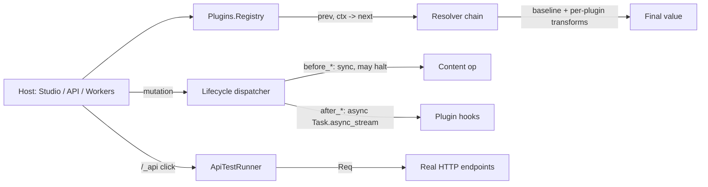
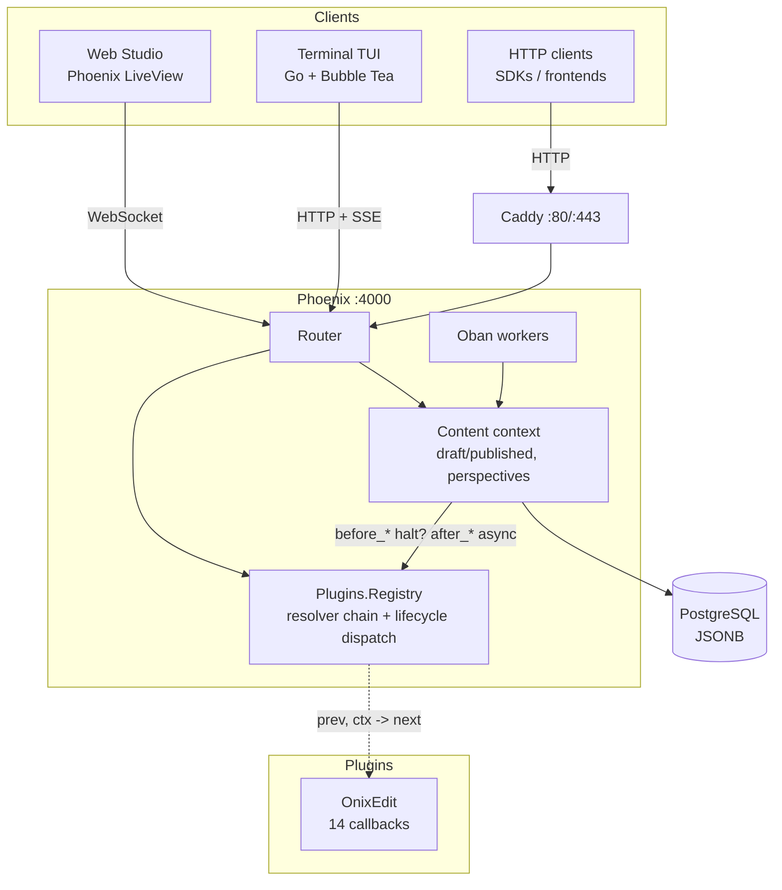

# Barkpark

A headless CMS with a Sanity-style desk structure, a draft/published model, and a plugin system. Three clients: a Phoenix LiveView Studio, a Go Bubble Tea TUI, and a REST API.

**Live demo:** http://89.167.28.206/studio

## At a glance

| | |
|---|---|
| Clients | Web Studio (LiveView), Terminal TUI (Go), REST API |
| Core model | Sanity-style draft/published, perspectives (`published` / `drafts` / `raw`) |
| Plugin system | `Barkpark.Plugin` behaviour — 14 callbacks, resolver chain, lifecycle hooks |
| Reference plugin | OnixEdit — ONIX 3.0 book metadata + Bokbasen integration |
| Tests | 1310 mix tests, 47 HTTP integration tests, full ONIX export round-trip |
| Stack | Elixir 1.19 / Phoenix LiveView 1.1 / PostgreSQL / Oban / Go 1.21+ |

## Interfaces

### Web Studio (LiveView)

Multi-pane desk at `/studio/:dataset` — drill into content types, filter by status, edit with autosave, publish/unpublish. Real-time updates across tabs via PubSub.

```
 Structure    | Post         | All Post       | Editor
--------------+--------------+----------------+---------------------
 Post       > | All Post     | * Getting S..  | Title
 Page         |--------------| * Why Headl..  | [Getting Started   ]
 Project      | Draft        | o Content M..  |
--------------| Published    |                | Slug        string
 Author       | Archived     |                | [getting-started   ]
 Category     |              |                |
--------------+              |                |
 Settings   > |              |                |
```

Bare `/studio` redirects to the default dataset.

### Terminal TUI (Go + Bubble Tea)

Same desk structure in the terminal. Keyboard-driven, talks to the Phoenix API over HTTP + SSE.

| Key | Action |
|-----|--------|
| `j` / `k` | Move up/down |
| `h` / `l` | Switch panes / drill in |
| `Enter` | Select / edit field |
| `Space` | Toggle boolean / cycle select |
| `Ctrl+S` | Save |
| `Esc` | Back |
| `q` | Quit |

Point the TUI at a remote server with `BARKPARK_API_URL=http://host:4000 go run .`

The TUI handles only v1 primitive field types. v2 plugin types (`composite`, `arrayOf`, `codelist`, `localizedText`) open as JSON in the TUI — edit those in the Studio. This is a declared v1 constraint, not a missing feature.

### REST API

Public reads, token-authed writes, Sanity-compatible mutation envelope.

```bash
# Read (public, no auth)
curl localhost:4000/v1/data/query/production/post
curl localhost:4000/v1/data/doc/production/post/p1

# Write (Bearer token)
curl -X POST localhost:4000/v1/data/mutate/production \
  -H "Authorization: Bearer barkpark-dev-token" \
  -H "Content-Type: application/json" \
  -d '{"mutations":[{"create":{"_type":"post","_id":"hello","title":"Hi"}}]}'

# Real-time (SSE)
curl -N -H "Authorization: Bearer barkpark-dev-token" \
  localhost:4000/v1/data/listen/production
```

| Route | Auth | Purpose |
|---|---|---|
| `GET /v1/data/query/:dataset/:type` | none | List documents |
| `GET /v1/data/doc/:dataset/:type/:id` | none | Single document |
| `POST /v1/data/mutate/:dataset` | token | create / patch / publish / unpublish / delete |
| `GET /v1/data/listen/:dataset` | token | SSE change stream |
| `GET /v1/preview/query/:dataset/:type` | preview JWT | Drafts read for previews |
| `GET /v1/schemas/:dataset` | admin | List schemas |
| `POST /v1/schemas/:dataset` | admin | Upsert schema |
| `DELETE /v1/schemas/:dataset/:name` | admin | Delete schema |
| `POST /media/upload` | token | Upload a file |
| `GET /media`, `GET /media/files/...` | none | List / serve media |
| `GET /api/documents/:type` | none | Legacy compat (deprecation headers) |

API quick reference: see the table above plus the `## API Quick Reference` section in [`CLAUDE.md`](CLAUDE.md).

## Plugin system

Barkpark's plugins are **first-party Elixir modules** that contribute data and behaviour. The host stays in charge of UI — plugins ship no LiveViews, no HEEx, no plugin-specific routes. UI is driven entirely by schema metadata plus the callback surface below.

### The 14 callbacks



| Callback | Resolver | Purpose |
|---|---|---|
| `manifest/0` | — | Frozen plugin.json (compile-time read) |
| `register_schemas/1` | — | SchemaDefinition rows installed at boot |
| `register_routes/1` | — | Reserved; plugins currently never own routes |
| `register_workers/1` | — | Child specs added to the supervision tree |
| `validate_settings/1` | — | Validate the plugin's settings row before save |
| `checkers/0` | `resolve_checkers/2` | Background invariant checkers |
| `action_handlers/0` | `resolve_action_handlers/2` | Named handlers for schema-declared actions |
| `external_sync_entries/0` | `resolve_external_sync_entries/2` | External system sync registry |
| `codelist_seeders/0` | `resolve_codelist_seeders/2` | Zero-arg seed functions for codelists |
| `settings_schema/0` | `resolve_settings_schema/2` | Fields rendered in the admin settings form |
| `top_menu_entries/0` | `resolve_top_menu_entries/2` | Tabs in the Studio topbar |
| `desk_items/1` | `resolve_desk_items/2` | Items in the root Structure pane |
| — | `resolve_doc_actions/2` | Per-doc action buttons (resolver-only; host seeds from schema) |
| `lifecycle_hooks/0` | — | Map of `before_*` / `after_*` doc hooks |
| `api_tests/0` | `resolve_api_tests/2` | Specs the live API runner fires on demand |

### Resolver chain

Each `resolve_X/2` is `(prev, ctx) -> next`. The host seeds `prev` with its built-in baseline; every plugin sees the running accumulator and returns a transformed value. Plugins can mutate, reorder, or remove sibling-plugin entries — not just append. When a plugin only implements the additive form, the `__using__/1` macro supplies a default that lifts `prev ++ result` (or `Map.merge/2` for map-shaped callbacks).

### Lifecycle hooks

Eight events bracket the four mutating Content operations:

| Phase | Events | Semantics |
|---|---|---|
| `before_*` | `before_save`, `before_publish`, `before_unpublish`, `before_delete` | Sync. `:ok` lets the op proceed; `{:halt, reason}` cancels it. Host surfaces `{:error, {:halted, reason}}` (HTTP 409). |
| `after_*` | `after_save`, `after_publish`, `after_unpublish`, `after_delete` | Async via `Task.async_stream` (5s timeout). Return value discarded. |

The hook payload carries `ctx.source` (`:studio` / `:api` / `:cli` / `:worker`) so workers that re-fire writes can bail out of their own hooks.

### API tests — a small worked example

`api_tests/0` returns declarative HTTP specs. The admin runner at `/studio/:dataset/_api` fires them against the live server via `Req`, evaluates asserts, then always runs `:cleanup` regardless of pass/fail. OnixEdit's four specs (abridged):

```elixir
def api_tests do
  [
    %{name: "Book schema exposed via /api/schemas",
      method: :get, path: "/api/schemas", auth: :none,
      asserts: [{:status, 200}, {:body_contains, ~s|"name":"book"|},
                {:duration_under_ms, 1_500}]},
    %{name: "Book schema exposed via /v1/schemas/production",
      method: :get, path: "/v1/schemas/production", auth: :admin,
      asserts: [{:status, 200}, {:body_contains, ~s|"name":"book"|}]},
    %{name: "Bokbasen top-menu tab renders",
      method: :get, path: "/studio/production", auth: :none,
      asserts: [{:status, 200}, {:body_contains, "Bokbasen"}]},
    %{name: "Mutation round-trip: create + cleanup-delete probe book",
      method: :post, path: "/v1/data/mutate/production", auth: :admin,
      body: %{"mutations" => [%{"create" => %{"_type" => "book",
                                              "_id" => "probe", "title" => "Probe"}}]},
      asserts: [{:status, 200}],
      cleanup: [_delete_probe_book]}
  ]
end
```

### Plugin admin (Studio)

- `/studio/:dataset/_plugins` — installed plugins, manifests, hot-reload
- `/studio/:dataset/_plugins/:plugin/settings` — settings form (Cloak-encrypted at rest)
- `/studio/:dataset/_api` — live API test runner

### Where to read more

- [`docs/plugins/ARCHITECTURE.md`](docs/plugins/ARCHITECTURE.md) — the contract in full
- [`docs/plugins/RECIPE.md`](docs/plugins/RECIPE.md) — build a plugin in one sitting
- [`docs/plugins/SCHEMA_V2.md`](docs/plugins/SCHEMA_V2.md) — `composite` / `arrayOf` / `codelist` / `localizedText`
- [`docs/plugins/INSTALL.md`](docs/plugins/INSTALL.md) — auto-install on boot, idempotency
- [`docs/plugins/INTEGRATION_LESSONS.md`](docs/plugins/INTEGRATION_LESSONS.md)
- [`docs/plugins/codelists-byo.md`](docs/plugins/codelists-byo.md)

## Quick start

### Local

```bash
git clone https://github.com/FRIKKern/barkpark.git
cd barkpark
cd api && mix deps.get && mix ecto.setup && cd ..
make dev      # tmux: Phoenix + TUI side by side
```

Open `http://localhost:4000/studio`.

### Deploy to a VPS

One command on any Ubuntu 22.04+ box (ARM64 or x86_64):

```bash
ssh root@YOUR_VPS_IP 'bash -s' < deploy.sh
```

Installs PostgreSQL, Erlang/Elixir (via ASDF — Erlang Solutions has no ARM packages), Go, Caddy, and a systemd unit. First run on ARM is 10–15 min (Erlang compiles from source).

Updates afterwards:

```bash
ssh root@YOUR_VPS_IP 'cd /opt/barkpark && git pull'   # post-merge hook rebuilds + restarts
# or, manually:
ssh root@YOUR_VPS_IP && cd /opt/barkpark && make deploy
```

Run [`./api/scripts/prod-postcheck.sh`](api/scripts/prod-postcheck.sh) after any `systemctl` operation. See [`docs/ops/PROD_OPS.md`](docs/ops/PROD_OPS.md).

## Draft/published model

| State | doc_id | Public API |
|---|---|---|
| Draft | `drafts.my-post` | Hidden |
| Published | `my-post` | Visible |

Editing a published doc creates a draft overlay. Publishing copies the draft to the published id and deletes the draft. Three perspectives: `published` (default public read), `drafts` (Studio), `raw` (everything).

## Schemas and field types

Schemas drive both clients and the desk structure. POST a schema and it appears in Studio + TUI automatically. Schemas with a `status` field of type `select` get filtered sub-views; `visibility: "private"` schemas appear under Settings as singletons.

### v1 primitives (handled natively by TUI + Studio)

| Type | Notes |
|---|---|
| `string` | Single-line text |
| `slug` | URL-safe identifier |
| `text` | Multi-line, `rows` option |
| `richText` | Block editor |
| `image` | Image upload |
| `select` | `options: [...]` |
| `boolean` | Toggle |
| `datetime` | Date + time |
| `color` | Color picker |
| `reference` | `refType: "author"` |
| `array` | Repeatable list |

### v2 plugin types (Studio only — TUI renders as JSON)

`composite`, `arrayOf`, `codelist`, `localizedText`. Reference: [`docs/plugins/SCHEMA_V2.md`](docs/plugins/SCHEMA_V2.md).

## Testing

```bash
cd api
mix test                                           # 1310 tests, ~9 known parallel-sandbox flakes
mix test test/barkpark_web/integration             # 47 HTTP integration tests
mix test test/barkpark/plugins/onixedit/export_proof_test.exs  # ONIX export round-trip
```

Integration tests cover the full documented HTTP contract: `halt_path`, `resolver_outputs`, `media`, `mutations`, `schema_admin`, `preview_routes`, `legacy_crud`. The ONIX round-trip is byte-stable (export → import → re-export, modulo `SentDateTime`).

The live API runner at `/studio/:dataset/_api` fires every plugin's `api_tests/0` against the real running server.

## Architecture



## Project structure

```
barkpark/
  main.go tui.go store.go schema.go             Go TUI (Bubble Tea + HTTP/SSE)
  structure.go styles.go
  deploy.sh Makefile                            VPS bootstrap, ops
  api/
    lib/barkpark/
      content.ex                                Document + schema CRUD, publish, perspectives
      plugin.ex                                 The 14-callback behaviour + __using__/1
      plugins/                                  Registry, resolver chain, bootstrap, onixedit/
      api_test_runner.ex                        Live runner backing /studio/:dataset/_api
    lib/barkpark_web/
      router.ex                                 Routes
      live/admin/                               PluginsLive, PluginSettingsLive,
                                                  ApiTestRunnerLive, BokbasenLive,
                                                  OnixeditStalenessLive
      live/studio/                              StudioLive, MediaLive
      controllers/                              Query, Mutate, Schema, Listen, Media,
                                                  Preview, Legacy, OnixeditExport
    priv/plugins/                               Plugin manifests + assets
    priv/repo/seeds.exs                         Seed: 8 schemas, sample docs, dev token
    test/barkpark/plugins/                      Plugin registry, resolver, lifecycle, api_tests
    test/barkpark_web/integration/              47 HTTP integration tests
  docs/plugins/                                 ARCHITECTURE, RECIPE, SCHEMA_V2, INSTALL, ...
  docs/ops/                                     PROD_OPS, bokbasen-go-live, rollback playbook
  web/                                          Next.js Vercel demo (optional, `make web`)
```

## OnixEdit reference plugin

End-to-end reference plugin: book editor → ONIX 3.0 export → Bokbasen `publisher` / `distributor` metadata-import API with a 9-state machine (`pending → staging → staged → polling → accepted | rejected | failed | cancelled | cannot_cancel`). Demonstrates the full plugin contract: Schema v2 types, codelist seeders, action handlers, settings (Cloak-encrypted), Oban workers, lifecycle hooks, top-menu and desk-item resolvers, and `api_tests/0`.

The validated ONIX 3.0 reference output lives at `proof/onix-sample.xml` and validates clean against the vendored EDItEUR XSD at `api/priv/onix/onix-3.0/ONIX_BookProduct_3.0_reference.xsd`. Regenerate with `cd api && mix onix.export_proof`; the drift guard is `api/test/barkpark/plugins/onixedit/export_proof_test.exs`.

Operations runbook (Bypass-mocked e2e suite, sandbox creds, retry/cancel, status dashboard): [`docs/ops/bokbasen-go-live.md`](docs/ops/bokbasen-go-live.md).

## Make targets

| Target | Purpose |
|---|---|
| `make dev` / `make api` / `make tui` / `make run` | Local dev |
| `make build` / `make web` / `make web-build` | Build TUI binary / Next.js demo |
| `make rebuild` / `make restart` / `make stop` / `make status` / `make logs` | Service lifecycle (server) |
| `make seed` / `make migrate` / `make reset-db` | Database |
| `make deploy` | git pull + clean + compile + restart |
| `make precheck` | Pre-merge gate (mirrors CI prod-compile + warnings-as-errors) |
| `make format` / `make format-check` / `make hooks` | Format gate |
| `make domain-cutover DOMAIN=…` | Update `PHX_HOST`/`PHX_SCHEME` on prod, restart, verify |
| `make docker-build` / `make docker-up` / `make docker-down` / `make docker-logs` | Docker alternative |

## Tech stack

| Layer | Tech |
|---|---|
| API | Elixir 1.19, Phoenix LiveView 1.1 |
| Persistence | PostgreSQL (JSONB), Ecto |
| Background jobs | Oban |
| HTTP client | Req |
| Encryption | Cloak (plugin settings at rest) |
| Real-time | Phoenix.PubSub, Phoenix LiveView, SSE |
| Auth | Bearer tokens (SHA256 hashed) |
| TUI | Go 1.21+, Bubble Tea, Lip Gloss |
| Reverse proxy | Caddy |

## License

MIT
