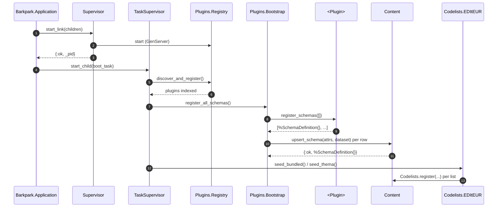
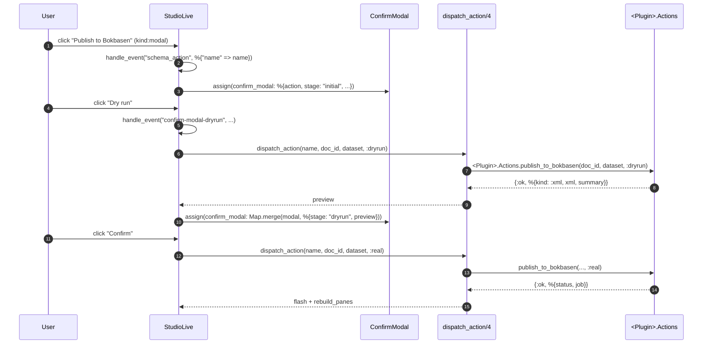

# Plugin Architecture — formal contract

> The forward-looking contract for building a new Barkpark plugin. Pair with
> [INTEGRATION_LESSONS.md](INTEGRATION_LESSONS.md) for the retrospective on
> *why* the contract looks the way it does, and [RECIPE.md](RECIPE.md) for a
> file-by-file worked example.

## Purpose

A Barkpark plugin is **schemas + business logic**. It contributes document
shapes, transformation pipelines, external-system clients, async workers, and
optional codelist data. It does not contribute UI. The host owns Studio, the
Studio editor pane, every field renderer, every pill, every modal, every
route. Plugins extend the host by **declaring metadata on schemas** and by
**exporting pure-function modules** the host calls into.

This is the headline lesson of the OnixEdit refactor (see
INTEGRATION_LESSONS.md). Every time a plugin tried to ship its own LiveView,
it drifted from the host's chrome, accumulated dead code, and confused users.
Treat the host as the canvas; treat schema metadata as the API.

## The Plugin contract

A plugin **MUST**:

- Ship a manifest at `priv/plugins/<plugin_name>/plugin.json` declaring
  `plugin_name`, `module`, `version`, and `capabilities`.
- Implement a top-level module that `use Barkpark.Plugin`s the manifest and
  exports `register_schemas/1` (returning a list of
  `%Barkpark.Content.SchemaDefinition{}` structs, possibly empty).
- Use the `<plugin_name>:<list_id>` codelist naming convention for every
  codelist it references (e.g. `vlie:status_code`).
- Use the `bp_<field>` prefix for any non-standard fields it stashes on
  documents (e.g. `bp_export_status`).

A plugin **MAY**:

- Ship JSON schema files under `priv/plugins/<plugin_name>/schemas/`.
- Ship pure-function transformation modules (exporters, parsers, validators).
- Ship HTTP clients to external systems.
- Ship Oban workers for async processing, polling, retries.
- Ship codelist data as JSON/XML under `priv/codelists/<plugin_name>/` and a
  `seed_*/0` helper that calls `Barkpark.Content.Codelists.register/3`.
- Ship sub-schema modules that splice into top-level schemas at
  `register_schemas/1` time.
- Ship a thin `<Plugin>.Actions` module exporting plain functions the host
  dispatches to via `handle_event("schema_action", ...)`.
- Use `Barkpark.Plugins.Settings` (encrypted at rest) for credentials.

A plugin **MUST NOT**:

- Ship LiveViews, HEEx templates, or function components.
- Ship CSS files or JavaScript / Web Components.
- Ship routes (except controller-mounted file-download endpoints under
  `/v1/plugins/<plugin_name>/...`).
- Ship plugin-specific field renderers — extend the four native v2
  field components for all plugins, not just yours.
- Broadcast plugin-specific PubSub messages when the generic
  `external_sync:<system>:<doc_id>` topic fits.
- Reach into `studio_live.ex` assigns or socket state directly. Use
  schema-declared actions; never a `phx-click` rooted in plugin code.

## File layout

Canonical directory structure for a plugin named `<plugin>`:

```
api/
├── lib/barkpark/plugins/<plugin>.ex             # entry module
├── lib/barkpark/plugins/<plugin>/
│   ├── actions.ex                               # optional: schema-action handlers
│   ├── schemas/                                 # optional: sub-schema modules
│   │   └── <sub>.ex
│   └── <subsystem>/                             # optional: business-logic groupings
│       ├── client.ex                            #   HTTP client
│       ├── publish_worker.ex                    #   Oban worker
│       ├── status.ex                            #   status read/write facade
│       └── settings.ex                          #   typed wrapper around Plugins.Settings
├── priv/plugins/<plugin>/
│   ├── plugin.json                              # manifest (required)
│   └── schemas/
│       ├── <doc_type>.json                      # one per top-level schema
│       └── <sub_type>.json                      # one per sub-schema
├── priv/codelists/<plugin>/                     # optional: codelist data
│   └── <list_id>.json
└── test/barkpark/plugins/<plugin>/
    ├── <plugin>_test.exs
    └── ...
```

The OnixEdit plugin is the canonical example. Mirror its layout for any
non-trivial integration; trim modules whose role you don't need.

## The schema-metadata contract

Every column on `Barkpark.Content.SchemaDefinition` that a plugin can populate.
The host reads these declaratively and renders generically.

| Column | Type | What it drives |
|---|---|---|
| `fields` | `{:array, :map}` | Field definitions. v1 primitives + v2 nested types (composite, arrayOf, codelist, localizedText). See [SCHEMA_V2.md](SCHEMA_V2.md). |
| `groups` | `{:array, :map}` | Tab bar in the editor pane. Each entry: `%{"name" => "core", "title" => "Core"}`. Fields tag themselves with one `group`. |
| `desk_groups` | `{:array, :map}` | Filter chips on the document-list pane. Bookmarkable via `?desk=...` URL. |
| `actions` | `{:array, :map}` | Action-bar buttons in the editor header. Three `kind`s: `link`, `event`, `modal`. |
| `initial_values` | `:map` | Deep-merged into new documents at create time. Resolves the `$today.year` token. |
| `cross_validations` | `{:array, :map}` | `any`/`all` predicate rules; banner display in the editor header. |
| `visibility` | `:string` | `"public"` (no auth on `GET /v1/data/query/...`) or `"private"` (admin-token required). |

### `desk_groups`

```json
{
  "name": "pending",
  "title": "Pending",
  "filter": {
    "content.bp_export_status.state": { "in": ["pending", "staging", "polling"] }
  }
}
```

Filter operators supported by `Content.list_documents/3`:

- `eq` — exact match: `{"status": {"eq": "draft"}}`
- `in` — set membership: `{"state": {"in": ["a", "b"]}}`
- `starts_with` — prefix match: `{"doc_id": {"starts_with": "drafts."}}`

Paths into JSONB fields use dot notation: `content.bp_export_status.state`.

### `actions`

Three flavours of action declaration. The host renders each kind differently.

**`kind: "link"`** — a plain `<a href>` with `:dataset` and `:id`
interpolated. No LiveView round-trip.

```json
{
  "name": "export_onix",
  "label": "Export ONIX",
  "kind": "link",
  "href": "/v1/plugins/onixedit/export/:dataset/:id.onix",
  "icon": "download"
}
```

**`kind: "event"`** — fires `phx-click="schema_action" phx-value-name="<name>"`
into StudioLive. The host calls back into `dispatch_action/4` (see "The
action-dispatch contract" below).

**`kind: "modal"`** — opens the generic `ConfirmModal` with an optional
two-stage `steps: ["dryrun", "real"]` flow. The host dispatches `:dryrun`
when the user clicks "Dry run", shows the preview, then dispatches `:real`
on confirmation.

```json
{
  "name": "publish_to_bokbasen",
  "label": "Publish to Bokbasen",
  "kind": "modal",
  "modal": {
    "title": "Publish to Bokbasen?",
    "body": "We'll run a dry-run first, then ask again before sending for real.",
    "steps": ["dryrun", "real"]
  },
  "icon": "send"
}
```

### `initial_values`

```json
{
  "notificationType": "03",
  "publishingDetail": {
    "copyrightStatement": { "copyrightYear": "$today.year" }
  },
  "bp_export_status": { "state": "draft" }
}
```

The token `$today.year` resolves at `Content.create_document/3` time via
`apply_initial_values/3`. Nested maps are deep-merged.

### `cross_validations`

```json
{
  "name": "isbn_xor_gtin",
  "title": "At least one product identifier is required",
  "rule": { "any": [
    { "field": "productIdentifiers", "operator": "non_empty" }
  ]},
  "level": "error",
  "fields": ["productIdentifiers"]
}
```

Predicate operators mirror `visibleWhen`: `eq`, `in`, `non_empty`, `empty`.
`level` is `"error"` or `"warning"`. The Phase 3 evaluator
(`Content.CrossValidator`) wraps `Components.Fields.Visibility.visible?` per
predicate and folds `any` / `all` over them.

## Per-field attributes plugins can declare

These attach to individual entries inside `fields`:

| Attribute | What it drives |
|---|---|
| `group` | Which tab the field renders in. Must match a `groups` entry. |
| `visibleWhen` | Predicate map referencing other fields. Same DSL as `cross_validations`. |
| `validations` | Per-field constraint list (currently surfaced post-save only). |
| `onix.element` | Small grey hint text under the label, e.g. `ONIX: <code>NotificationType</code>`. Generic enough that any plugin can do `<plugin>.element`; only `onix` is renderered today. |
| `bp_*` | Plugin custom fields stashed on documents. Locked prefix — see SCHEMA_V2.md. |
| `plugin:<name>:<field>` | Plugin-private fields. Rejected unless `parse/2` is called with `plugin: "<name>"`. |

## Plugin callbacks

`use Barkpark.Plugin` injects default no-op implementations of every
optional callback so a freshly-generated plugin compiles without
declaring anything. Override the callbacks your plugin actually needs.
All ten callbacks (one required + nine optional) are listed here as a
single reference — the host walks `Plugins.Registry.all/0` and asks each
plugin module for its contribution at the relevant lifecycle point.

| Callback | Required? | Returns | Called by |
|---|---|---|---|
| `manifest/0` | yes (injected by `__using__`) | the parsed `plugin.json` map | `Plugins.Registry` on register |
| `register_routes/1` | optional | `:ok` (router hook) | reserved — not invoked today |
| `register_workers/1` | optional | list of child specs | reserved — not invoked today |
| `register_schemas/1` | optional | list of `%SchemaDefinition{}` | `Plugins.Bootstrap.register_all_schemas/0` |
| `validate_settings/1` | optional | `:ok` or `{:error, [{atom, String.t()}]}` | `Plugins.Settings` writes |
| `checkers/0` | optional | list of `{name, module}` for value-checkers | `Validation.Registry.reload_plugin_checkers/0` |
| `action_handlers/0` | optional | `%{name => fun/3}` | `Plugins.Registry.collect_action_handlers/0` → `StudioLive.dispatch_action/4` |
| `external_sync_entries/0` | optional | `%{system_name => %{label, states}}` | `Plugins.Registry.collect_external_sync_entries/0` → `ExternalSync.all/0` |
| `codelist_seeders/0` | optional | list of zero-arg functions | `Plugins.Registry.run_all_codelist_seeders/0` in the boot Task |
| `settings_schema/0` | optional | list of `%{name, type, label, …}` field declarations | `BarkparkWeb.Admin.PluginSettingsLive` at `/studio/:dataset/_plugins/:plugin/settings` |

### `settings_schema/0` — browser-managed plugin credentials

The tenth callback turns a plugin's encrypted `plugin_settings` row into
an admin form, replacing the SSH + `mix run` ceremony for setting
secrets. Each entry declares one form field:

```elixir
@impl Barkpark.Plugin
def settings_schema do
  [
    %{name: "bokbasen.api_base", type: :url, label: "Bokbasen API base URL",
      required: true, default: "https://api.bokbasen.io", group: "Bokbasen"},
    %{name: "bokbasen.client_secret", type: :password, label: "Client secret",
      required: true, group: "Bokbasen",
      hint: "Stored encrypted at rest via BARKPARK_CLOAK_KEY"}
  ]
end
```

Field names are **dot-namespaced**. The leading segment selects which
`plugin_settings` row the value lands in; the trailing remainder is the
flat key inside that row. So `"bokbasen.api_base"` writes
`%{"api_base" => …}` to the `"bokbasen"` row — the exact shape
`Bokbasen.Client` already reads back via
`Bokbasen.Settings.get_credentials/0`. The LV does not invent a new
storage layout; it mirrors what each runtime client expects.

Supported `:type` values:

| Type | Renders as | Notes |
|---|---|---|
| `:string` | `<input type="text">` | |
| `:url`    | `<input type="url">`  | Validated `http://` / `https://` prefix on submit. |
| `:password` | `<input type="password">` | NEVER pre-filled. Stored values are echoed as `••••••` placeholder; Reveal / Clear buttons appear when something is on file. Saving an empty password preserves the existing value. |
| `:select` | `<select>` with `options` | Server-side check against the option list. |
| `:boolean` | checkbox + hidden default | Hidden `false` paired with checked `true` so unchecked posts as `false`. |

When `validate_settings/1` is also defined, the LV invokes it with the
nested map shape the plugin already uses (`%{"<row>" => %{<key> => …}}`)
so existing validators keep working. Any returned
`{:error, [{field, msg}, …]}` is folded into inline per-field errors.

The "Bokbasen" group also ships a "Test connection" button that calls
`Bokbasen.Auth.token/0` and flashes the result — purely additive, no
host knowledge required.

### Example — OnixEdit's three runtime contributions

```elixir
@impl Barkpark.Plugin
def action_handlers do
  %{
    "publish_to_bokbasen" => &Barkpark.Plugins.OnixEdit.Actions.publish_to_bokbasen/3
  }
end

@impl Barkpark.Plugin
def external_sync_entries do
  %{
    "bokbasen" => %{
      label: "Bokbasen",
      states: %{
        "pending"  => %{color: "gray",   label: "Pending"},
        "accepted" => %{color: "green",  label: "Accepted"},
        "rejected" => %{color: "red",    label: "Rejected"},
        nil        => %{color: "gray",   label: "Not synced"}
        # ...
      }
    }
  }
end

@impl Barkpark.Plugin
def codelist_seeders do
  [
    &Barkpark.Codelists.EDItEUR.seed_bundled/0,
    &Barkpark.Codelists.EDItEUR.seed_thema/0
  ]
end
```

These three callbacks replaced what used to be three hardcoded
touchpoints in the host (a `dispatch_action/4` clause in
`studio_live.ex`, a `@entries` map in `external_sync.ex`, and a pair of
seed calls in `application.ex`). Declarative plugin metadata; zero host
edits per integration.

## Plugin lifecycle

Startup sequence from BEAM boot to first request:



The boot Task is supervised by `Barkpark.TaskSupervisor` and runs **after**
the endpoint is up, so a slow filesystem walk or a misbehaving plugin never
blocks request serving. Per-plugin `try/rescue` inside `Bootstrap` keeps a
bad plugin from tanking the whole sweep.

Idempotency: `Content.upsert_schema/2` reads first via `get_schema(name,
dataset)`, then routes to `Repo.update` for existing rows or `Repo.insert`
for new ones. Re-running `register_all_schemas/0` produces zero new rows on
an already-bootstrapped database — field values are refreshed from the
plugin's current code on every boot.

Two callers invoke `register_all_schemas/0`:

1. `Barkpark.Application.start/2` post-boot Task — every server start.
2. `priv/repo/seeds.exs` — `mix ecto.reset` / `mix run priv/repo/seeds.exs`.

Both paths converge on the same function so behaviour stays in sync.

## The action-dispatch contract

A plugin declares actions in its schema's `actions` column. The host renders
them in the editor header and routes clicks back through one of three paths,
depending on `kind`.



### `dispatch_action/4` — runtime Registry lookup

`StudioLive.dispatch_action/4` is a one-liner that asks
`Barkpark.Plugins.Registry.collect_action_handlers/0` for the merged
`%{action_name => fun/3}` map and calls the matching handler:

```elixir
defp dispatch_action(name, doc_id, dataset, mode) do
  case Map.get(Barkpark.Plugins.Registry.collect_action_handlers(), name) do
    handler when is_function(handler, 3) -> handler.(doc_id, dataset, mode)
    _ -> {:error, {:unknown_action, name}}
  end
end
```

**Adding a new plugin action requires NO host edits.** The plugin
declares its handlers via the `Barkpark.Plugin.action_handlers/0`
callback (see "Plugin callbacks" below) and the host picks them up
on the next boot. The convention is still plugin-prefixed names
(`publish_to_vlie`, `validate_with_onyx`) so collisions across plugins
are impossible. On collision the lexicographically-latest plugin name
wins — Registry iteration is alphabetically sorted.

Action handler return contract:

- `{:ok, %{kind: :xml, xml: binary, summary: map}}` — dry-run preview
- `{:ok, %{status: map, job: Oban.Job.t()}}` — real enqueue
- `{:error, reason}` — anything else; the host formats via
  `format_action_error/1`

## External-sync pattern

When a plugin needs status UI on a document — pending, accepted, rejected,
synced — it plugs into the generic `external_sync:<system>:<doc_id>`
contract. **No plugin UI required.**

Three pieces:

1. **Registry entry** declared by the plugin's
   `external_sync_entries/0` callback. Declares the system label and
   per-state color/label table:

   ```elixir
   @impl Barkpark.Plugin
   def external_sync_entries do
     %{
       "vlie" => %{
         label: "Vlie",
         states: %{
           "pending"  => %{color: "gray",  label: "Pending"},
           "accepted" => %{color: "green", label: "Accepted"},
           "rejected" => %{color: "red",   label: "Rejected"},
           nil        => %{color: "gray",  label: "Not synced"}
         }
       }
     }
   end
   ```

2. **Broadcast on state transitions** from the plugin's worker:

   ```elixir
   ExternalSync.broadcast("vlie", doc_id, "accepted", patch)
   ```

3. **The host renders the pill automatically** via
   `BarkparkWeb.Components.ExternalSyncPill` — it reads
   `Barkpark.ExternalSync.all/0`, which merges host-owned entries
   (`@entries` in `external_sync.ex`, today empty) with every plugin's
   contribution via `Plugins.Registry.collect_external_sync_entries/0`.

Adding a new system **requires NO host edits** — declare it in
`external_sync_entries/0` and the next boot picks it up. Plugin entries
win on key collision so a plugin can override a built-in entry if it
needs to. The merge is a runtime GenServer call (no boot-time snapshot);
v1 keeps things simple — if the pill renderer ever shows up hot in a
flamegraph, this is the obvious cache target.

## Codelist contribution

When a plugin owns codelist data (controlled vocabularies, taxonomies):

1. **Ship the data** as a static JSON/XML file under
   `api/priv/codelists/<plugin>/`. Per the bring-your-own-snapshot
   convention (Decision 21), plugins do **not** bundle EDItEUR-licensed data
   — the publisher provides their licensed snapshot at install time.

2. **Declare seeders via the `codelist_seeders/0` callback.** The post-
   boot Task in `Barkpark.Application.start/2` calls
   `Barkpark.Plugins.Registry.run_all_codelist_seeders/0`, which walks
   every registered plugin and invokes each seeder in a per-seeder
   `try/rescue`. Adding a new codelist source **requires NO host
   edits** — the plugin returns a list of zero-arg functions:

   ```elixir
   @impl Barkpark.Plugin
   def codelist_seeders do
     [
       &Barkpark.Codelists.EDItEUR.seed_bundled/0,
       &Barkpark.Codelists.EDItEUR.seed_thema/0
     ]
   end
   ```

   Each seeder must be idempotent and non-raising in the happy path;
   Registry catches anything that escapes, logs a warning, and moves on
   to the next plugin so one broken plugin can't tank boot.

3. **Reference codelists from schema fields** by their `<plugin>:<list_id>`
   friendly name:

   ```json
   {
     "name": "status",
     "type": "codelist",
     "codelistId": "vlie:status_code",
     "version": "2026"
   }
   ```

   The codelist registry (`Barkpark.Content.Codelists`) uses
   `(plugin_name, list_id, issue)` as its uniqueness key, so two plugins can
   register a list named `language` without colliding.

4. **Alias resolution.** If a schema declares
   `onix.codelistId: <integer>`, the alias resolver
   (`Codelists.Adapter.resolve_plugin/2`) falls back to the EDItEUR ONIX
   list number — useful for ONIX-flavoured plugins. Non-ONIX plugins use
   the `<plugin>:<list_id>` friendly name exclusively.

## What's NOT in the contract

Plugins explicitly must not touch:

- **LiveViews / HEEx / function components.** The host owns Studio, the
  editor pane, all field renderers, all modals.
- **Routes** beyond controller-mounted file endpoints under
  `/v1/plugins/<plugin>/...` (e.g. `/v1/plugins/onixedit/export/.../X.onix`).
  Document edit URLs are always `/studio/:dataset/:type/:id` — host-owned.
- **CSS files.** Inline styles in `root.html.heex` using existing
  `--bg` / `--fg` / `--border` CSS variables. If a plugin needs a new
  style, it's a host-level addition.
- **JavaScript / Web Components.** The `bp-*` custom elements are
  host-owned. A plugin proposing one is proposing a host feature.
- **Migrations beyond plugin-specific tables.** `plugin_settings` is the
  host-owned encrypted store accessed via `Barkpark.Plugins.Settings`.
- **Direct `studio_live.ex` socket assigns.** Use schema-declared actions
  and the `dispatch_action/4` clause; never `phx-click` from plugin code.
- **Plugin-specific PubSub topics** when `external_sync:<system>:<doc_id>`
  fits. Generic topics work for any future plugin.

## Testing a plugin

Patterns proven on OnixEdit:

- **Pure-function tests** for transformation modules (exporters, parsers,
  validators, formatters). No DB, no LiveView. Lives at
  `test/barkpark/plugins/<plugin>/export/*_test.exs`.
- **Round-trip byte-for-byte tests** if the plugin parses + emits data.
  Catches non-determinism in encoders (Erlang's small-map ordering
  surprised the OnixEdit Message wrapper — fix was keyword lists).
- **Bootstrap integration test** if the plugin contributes schemas +
  codelists. Asserts `register_all_schemas/0` returns `{:ok, _}` and the
  expected rows are in `schema_definitions` / `codelist_values`.
- **Action smoke tests** at `test/barkpark/plugins/<plugin>/actions_test.exs`
  — call `<Plugin>.Actions.<action>/3` directly with a fixture document.

**LiveView tests are host tests, not plugin tests.** A plugin must not
write `studio_live_test`. If a schema-declared action breaks the host
editor, the failure surfaces in the host's StudioLive test suite, not in
the plugin's.

## Pointer index

| Concern | File |
|---|---|
| Plugin behaviour | `api/lib/barkpark/plugin.ex` |
| Plugin discovery | `api/lib/barkpark/plugins/registry.ex` |
| Schema bootstrap | `api/lib/barkpark/plugins/bootstrap.ex` |
| Schema definition | `api/lib/barkpark/content/schema_definition.ex` |
| Codelist registry | `api/lib/barkpark/content/codelists.ex` |
| External-sync host map | `api/lib/barkpark/external_sync.ex` (empty `@entries`; plugin-owned slice merged at call time) |
| External-sync pill | `api/lib/barkpark_web/components/external_sync_pill.ex` |
| Schema-action dispatch | `api/lib/barkpark_web/live/studio/studio_live.ex` (`dispatch_action/4` — one-liner over `Plugins.Registry.collect_action_handlers/0`) |
| Plugin collectors | `Plugins.Registry.collect_action_handlers/0` · `collect_external_sync_entries/0` · `run_all_codelist_seeders/0` |
| ConfirmModal | `api/lib/barkpark_web/components/confirm_modal.ex` |
| Plugin settings (encrypted) | `api/lib/barkpark/plugins/settings.ex` |
| OnixEdit reference plugin | `api/lib/barkpark/plugins/onixedit.ex` and subtree |
| OnixEdit manifest | `api/priv/plugins/onixedit/plugin.json` |
| OnixEdit book schema | `api/priv/plugins/onixedit/schemas/book.json` |
| Application boot hook | `api/lib/barkpark/application.ex` |

For a worked file-by-file example of building a plugin from this contract,
see [RECIPE.md](RECIPE.md).
