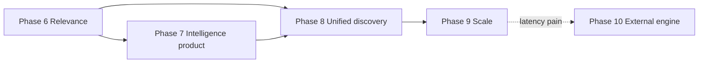

# Search Intelligence — Phases 6–10 (Relevance & Maturity Plan)

> **Status:** Phases 0–8 are shipped to production; Phases 9–10 remain forward plan (May 2026).  
> **North star:** Postgres remembers and explains; retrieval gets better every week without an external search SaaS.  
> **Benchmarks:** Algolia (analytics loop), Sanity (`score` + perspectives), WoodWing (faceted DAM), Meilisearch/Typesense (API ergonomics), Doug Turnbull (evaluation + hybrid retrieval).

---

## What we have today (Phases 0–5 ✓)

| Capability | Implementation |
|------------|----------------|
| Multi-surface intelligence | `surface` + `scope`; media + documents adapters |
| Suggest buckets | recent (raw) / popular / nohits (crystals + today) |
| Click → CTR | `event_type`, `query_event_id`, crystal `ctr` |
| Quality gate | `Sanitizer`, tags, test exclusion, debounced record |
| Synonym loop | `search_synonyms`, admin CRUD, `synonymCandidates`, apply at query time |
| Document hybrid retrieval | `search_vector` (title FTS) + ILIKE + `pg_trgm` similarity |
| Media faceted search | WoodWing-style facets + synonym expansion |

**Gap vs best-in-class:** field-weighted ranking, query understanding, highlights, zero-hit recovery, evaluation harness, federated Studio search, scale hardening.

---

## Design principles (do not break)

1. **Intelligence stays in Postgres** — events, crystals, synonyms, merge patterns. No analytics in Typesense/Algolia even if we add an external retriever later.
2. **Surfaces stay thin** — adapters translate params; core owns rollups and improvement signals.
3. **Search never blocks on analytics** — record path must remain async-safe (Phase 9 makes this strict).
4. **Every ranking change is measurable** — golden-query harness before/after (Phase 7).
5. **Admin promotes evidence, not hunches** — synonym candidates show CTR, transitions, confidence (Phase 7).

---

## Architecture after Phase 10

```
┌──────────────────────────────────────────────────────────────────┐
│  Clients: bp-asset-explorer · bp-media-picker · bp-reference-    │
│           picker · Studio ⌘K · public API                        │
└────────────────────────────┬─────────────────────────────────────┘
                             │ X-BP-Search-* · searchEventId
┌────────────────────────────▼─────────────────────────────────────┐
│  Surface adapters (documents · media · federated)                │
└────────────────────────────┬─────────────────────────────────────┘
                             │
┌────────────────────────────▼─────────────────────────────────────┐
│  Barkpark.Search.QueryPipeline  ← NEW (Phase 6)                  │
│  parse → expand(synonyms) → retrieve → rank → highlight          │
└────────────┬───────────────────────────────┬─────────────────────┘
             │                               │
┌────────────▼──────────────┐   ┌───────────▼──────────────────────┐
│  Retrieval (Postgres)      │   │  Barkpark.Search.Intelligence     │
│  FTS · trgm · ILIKE       │   │  record · suggest · insights      │
│  [optional Typesense]     │   │  crystals · merge · synonyms      │
└───────────────────────────┘   └──────────────────────────────────┘
```

---

## Phase 6 — Relevance engineering (P1, ~2 weeks)

**Why:** Algolia `searchableAttributes`, Sanity `boost()`, Meilisearch ranking rules, Typesense `typo_tokens_threshold`. We have retrieval; we lack **controlled ranking** and **zero-hit recovery**.

### 6.1 Search settings per surface

New table `search_surface_config` (or JSON in plugin settings — prefer table for query-time cache):

| Column | Example |
|--------|---------|
| `surface`, `scope` | `documents`, `production` |
| `searchable_fields` | `[{"path":"title","weight":10},{"path":"content.slug","weight":3}]` |
| `typo_policy` | `%{"min_len_1typo":5,"min_len_2typo":9,"enabled":true}` |
| `zero_hit_strategy` | `"drop_tokens"` \| `"prefix_all"` \| `"none"` |
| `highlight_fields` | `["title"]` |

Admin API: `GET/PUT /v1/data/search/:dataset/settings` (+ media mirror).

Default configs ship in seeds for `documents` and `media` so behavior is explicit, not implicit.

### 6.2 `Barkpark.Search.QueryPipeline`

Single entry for all retrieval (documents + media refactor):

```elixir
QueryPipeline.search(surface, scope, context, opts)
# => {:ok, %{hits: [...], total: n, highlights: %{}, ms: n, explain: optional}}
```

Stages:

| Stage | Behavior |
|-------|----------|
| **Parse** | Split tokens; support quoted phrases (`"hero image"`), `-exclude`, `*` prefix (Sanity/Algolia subset) |
| **Expand** | Existing `Synonyms.search_terms/3` + optional stem/normalize |
| **Retrieve** | OR across terms; per-field weights in SQL (`ts_rank * weight`) |
| **Recover** | If `total == 0`: drop last token → retry (Algolia removeWordsIfNoResults); then widen typos (`typo_tokens_threshold` analog) |
| **Rank** | Combine `ts_rank`, trgm similarity, exact-match boost, recency tie-break |
| **Highlight** | `ts_headline` or regex wrap for ILIKE matches |

Documents: extend `search_vector` generated column to include slug from `content` JSON when present.

Media: keep facet pipeline; inject weighted rank into relevance sort.

### 6.3 API response enrichment

Extend search JSON (both surfaces):

```json
{
  "documents": [...],
  "count": 42,
  "query": "hero",
  "parsedQuery": {"terms": ["hero"], "phrases": [], "excludes": []},
  "highlights": {"drafts.p1": {"title": "Elixir <mark>Hero</mark> Guide"}},
  "searchEventId": "...",
  "ms": 12,
  "recovery": null
}
```

`recovery`: `"drop_tokens"` \| `"typo_widen"` when zero-hit strategy fired — useful for insights.

### 6.4 Tests & exit criteria

| Test | Pass |
|------|------|
| `"phoenix -wright"` excludes author | Document count drops |
| Synonym + recovery | Zero-hit query finds via synonym or token drop |
| Weight order | Title match ranks above body-only match |
| Regression | All existing search + intel tests green |

**Exit:** Document and media search use `QueryPipeline`; admin can read settings; highlights in picker responses.

---

## Phase 7 — Intelligence productization (P1, ~2 weeks)

**Why:** Algolia Analytics + AI Synonyms promote flow; Turnbull/Quepid evaluation discipline.

### 7.1 Golden query harness

New `test/search_golden/` (or `api/test/barkpark/search/golden_test.exs`):

```
test/search_golden/
  documents/production.jsonl   # {"q":"phoenix","expect_ids":["p1"],"max_rank":3}
  media/production.jsonl
```

Mix task: `mix search.eval [--surface documents] [--before SHA] [--after SHA]`

Outputs NDCG@10, zero-hit rate, MRR on golden set. **CI gate:** no regression on golden suite when touching ranking.

### 7.2 Synonym promotion UX (API-first)

Enhance `synonymCandidates` payload:

```json
{
  "from": "hero",
  "to": "phoenix",
  "transitions": 12,
  "reason": "zero_to_hit",
  "evidence": {
    "fromZeroHitRate": 0.85,
    "toCtr": 0.42,
    "confidence": 0.78
  }
}
```

`POST …/synonyms/promote` accepts candidate `{from, to}` and sets `source: "auto"`.

Optional: `POST …/synonyms/preview?q=hero` — dry-run hit count before/after.

### 7.3 Insights dashboard fields

Add to `/insights` result:

| Field | Source |
|-------|--------|
| `zeroHitRate` | quality + top queries |
| `recoveryRate` | events where `recovery` metadata set (Phase 6) |
| `synonymImpact` | A/B crystal compare week-over-week post-promote |
| `lowCtrQueries` | `searchCount >= 10 && ctr < 0.1` (hints already partial) |

### 7.4 Nohit → action workflow

Document admin runbook in `INTELLIGENCE.md`:

1. Insights → top nohit queries  
2. Preview synonym or tag fix  
3. Promote → verify golden query  
4. Track `searchCountDelta` + zero-hit rate next week  

### 7.5 Exit criteria

| Metric | Target |
|--------|--------|
| Golden suite | ≥ 30 queries per surface in repo |
| CI | `mix search.eval` runs on PRs touching `QueryPipeline` or synonyms |
| Promote flow | API promote + preview documented |

---

## Phase 8 — Unified discovery (P2, ~1.5 weeks)

**Why:** Typesense `multi_search`; Studio ⌘K expects one box across documents, media, references.

### 8.1 Federated search endpoint

```
GET /v1/search/:dataset?q=…&surfaces=documents,media&limit=10
```

Returns:

```json
{
  "results": {
    "documents": {"hits": [...], "total": 5},
    "media": {"hits": [...], "total": 12}
  },
  "searchEventId": "...",
  "ms": 25
}
```

Implementation: parallel `Task.async` per surface through adapters; **one** intelligence record with `tags: ["federated"]` and filters `{surfaces: [...]}`.

### 8.2 Cursor pagination (media)

Replace offset for explorer infinite scroll:

| Request | Response |
|---------|----------|
| `cursor` (opaque) | `nextCursor`, `hasMore` |

Encode `(sort_key, id)` signed or base64 — Stripe/Typesense pattern. Keep `offset` for backward compat (deprecated header).

### 8.3 Shared client module

Extract `bp-search-intel.js`:

| Concern | Single implementation |
|---------|----------------------|
| Client id | `X-BP-Search-Client` |
| Debounce 350ms + Enter flush | |
| `X-BP-Search-Record: 1` | |
| Click/select → interaction POST | |
| `searchEventId` chaining | |

Replace duplicated logic in explorer, media picker, reference picker.

### 8.4 Studio ⌘K (optional same phase)

LiveView or JS overlay calling federated endpoint; facet filters as secondary chips.

**Exit:** Federated API live; media cursor works; one JS module imported by all pickers.

---

## Phase 9 — Scale & ops (P2, trigger-based)

**Why:** Original roadmap Phase 6; Postgres partitioning research.

**Triggers:** events > 5M/scope, prune > 30s, or suggest p95 > 50ms at 100k events.

| Task | Detail |
|------|--------|
| Async record | Oban `:search_intel` insert; API returns immediately |
| Partition events | Monthly RANGE on `inserted_at`; DROP not DELETE |
| Crystal retention | Day 90d; week/month 2y |
| SQL crystallize | `INSERT…SELECT` when >100k events/day |
| Session recent table | Optional hot-path for autocomplete |
| Telemetry dashboard | Grafana from `[:barkpark, :search, :intel, :record]` |

**Exit:** Prune O(1); crystallize bounded memory; record never blocks search p99.

---

## Phase 10 — Optional external retriever (P3, pain-gated)

**Why:** Typesense/Elastic when Postgres p95 > 100ms on fuzzy faceted queries at corpus size.

| Trigger | Action |
|---------|--------|
| >500k media assets OR fuzzy p95 > 100ms | Typesense collection per surface |
| Intelligence | **Stays in Postgres** — mirror hits to record events only |
| Autocomplete CDN | Optional mirror of top crystals → Typesense `popular_queries` |
| Skip Algolia SaaS | Unless enterprise mandate |

Sync: document/media upsert webhooks → Typesense index; Postgres remains source of truth.

---

## Execution graph



**Recommended order:** 6 → 7 → 8 in sequence (7 depends on 6 highlights/recovery metadata; 8 depends on stable pipeline). 9 when volume demands. 10 only on SLA failure.

---

## Work packages (implementer checklist)

### Phase 6 — Done ✓

- [x] Migration `search_surface_config`
- [x] `Barkpark.Search.QueryPipeline` (`api/lib/barkpark/search/query_pipeline.ex`)
- [x] `Barkpark.Search.QueryParser` (phrases, exclude, prefix)
- [x] `Barkpark.Search.Highlighter`
- [x] Refactor `Content.search_documents` → pipeline
- [x] Refactor `Media.Search` text match → pipeline
- [x] Extend `search_vector` for slug (migration)
- [x] Admin settings routes + tests (router ~:486–487)
- [x] Update `INTELLIGENCE.md`

### Phase 7 — Done ✓

- [x] Golden JSONL fixtures + `mix search.eval` (`api/lib/mix/tasks/search.eval.ex`)
- [x] CI job on ranking changes
- [x] Richer `synonymCandidates` evidence
- [x] `POST …/synonyms/promote` + preview (router ~:489–491)
- [x] Insights: `zeroHitRate`, `recoveryRate`

### Phase 8 — Done ✓

- [x] `FederatedSearchController` (`api/lib/barkpark_web/controllers/federated_search_controller.ex`, router ~:625)
- [ ] Media cursor pagination
- [x] `bp-search-intel.js` + picker migration (`api/priv/static/assets/bp-search-intel.js`)
- [ ] Studio ⌘K spike (optional)

### Phase 9

- [ ] Oban async record worker
- [ ] Partition migration + prune worker update
- [ ] SQL crystallize path

### Phase 10

- [ ] Spike doc only until trigger hit

---

## Success metrics (cumulative)

| Metric | Phase 6 | Phase 7 | Phase 8 |
|--------|---------|---------|---------|
| Golden NDCG@10 | baseline | no regression | no regression |
| Zero-hit rate (top 50 queries) | −10% | −25% vs baseline | −30% |
| CTR coverage | — | >60% searches | >70% |
| Suggest p95 | <50ms | <50ms | <50ms |
| Picker highlight usage | shipped | — | — |
| Federated queries/week | — | — | measurable in insights |

---

## What we still deliberately skip

| Feature | Reason |
|---------|--------|
| Algolia Recommend / co-purchase | Not a storefront |
| Personalized ranking | Insufficient profile data; privacy |
| Full merchandising rules engine | Editorial workflow ≠ e-commerce |
| Vector semantic search (Phase 10+) | Defer until lexical ceiling hit; adds ops cost |
| Redis recent cache | Postgres fine until Phase 9 triggers |

---

## References

- `docs/search/ROADMAP.md` — full phase history
- `docs/search/INTELLIGENCE.md` — runtime architecture
- Algolia: searchable attributes, queryID, AI synonyms, empty results strategies
- Sanity: `groq2024`, `score()`, `boost()`, perspectives
- Meilisearch / Typesense: ranking rules, typo policy, multi_search
- WoodWing: faceted search API contract
- Doug Turnbull: hybrid retrieval + evaluation (Quepid mindset)
